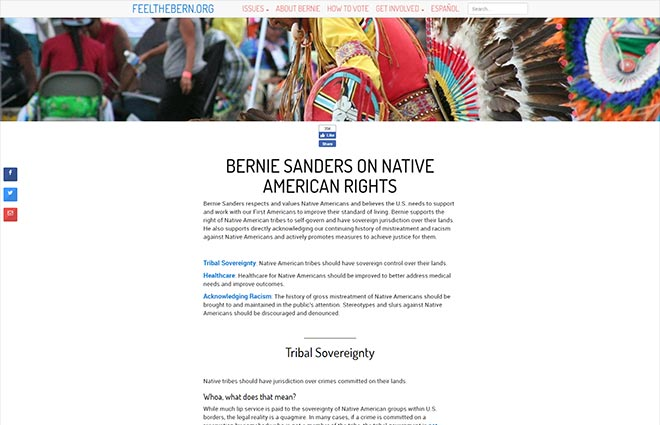
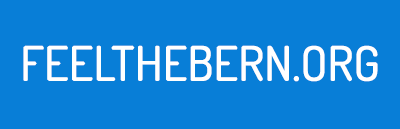

FeelTheBern.org is a community written website that provides the viewpoints with sources for the 2016 presidential candidate Bernie Sanders. The website has since then received millions of visitors and appeared on dozens of top journalist organizations content. Apart from being one of three developers and administrators I also managed side projects such as the domain handling, user experience research, accessibility features, downloadable flyer kit, sharing features, and gigantic social media campaigns. This project threw me into the deep end of a trending fast-paced remote environment and the learning experience was invaluable.

## Challenge

Create a crowdsourced information repository for a political candidate that is backed up by relevant sources. This website should be easy to navigate across hundreds of issues including the ability to search. The website should be targeted to as many people as possible and such use simple language where and diagrams; translation is a priority. This website will act as a resource for activists so mobile and offline versions should be as easy to use as the desktop version.

## Approach

### User Experience

Organizing the categories for the impending massive amount of research was a challenge. After we settled on the topics and grouped over 150 community volunteer writers I conducted user experience research to determine how those topics should be grouped and navigated. This was my first foray into conducting usability testing and taught me the basics of understanding human interaction on a large scale. The content is accessible through either the “Issues” dropdown, a search function, or through the large picture blocks on the homepage. The blocks are fully responsive and proved to be a great way to navigate lots of pages.

### Typography

The header font for this website along with the logo and navigation is Dosis Medium which was introduced to me by my co-developer. I initially pushed back on this decision because I wanted the website to be serious and well-designed but looking back I am very glad the decision was made to stay with Dosis because the simplicity is appealing to a wider audience. The body font is Roboto because the contrast to the headers was important to me but with such a vast amount of content I wanted the experience to be not exhausting. Roboto proved to be perfect for this as an easily scan-able font that fits into the overall light and simplistic design.

### Color

The colors for FeelTheBern.org are simple and reflect the political nature of the content. It is well researched that users read better on light backgrounds so this design decision was simple. Links are a simple blue color that adapt to the common mental model of default blue links. The light red provides a nice accent for contrasting content from the main blue or bringing together a design element.

### Project Management

Besides development and design, I also managed many side projects that were essential to the construction, maintainability, and relevancy of the project. In the crunch time of a fast-paced environment I spent many nights editing and importing our community written content that numbers over 120,000 words (around the size of a J. K. Rowling novel). This meant managing a large amount of people and having to deliver huge written content (by volunteers) on time and at a well vetted quality. I learned a lot about conducting myself in a business-like fashion between administration, workers, and in the social media environment. I also added our “skip to content”, screen reading, and contrasted highlighting accessibility features. These were important to me as a learning experience and to adapt for our large variety user base.

### Social Media Campaigns

The social media campaigns were a fantastic success with my thunderclap reaching 1,695,892 people and smashing my supporters goal by 425%. I achieved this by spending countless hours researching and contacting valuable social media personalities and exhausting as many social media outlets as possible to get the word out. Our website was written about in blogs by [Mark Ruffalo](https://twitter.com/MarkRuffalo/status/652159617615577088), [Vegan.com](https://www.facebook.com/VeganDotCom/posts/10153184488931872), and [Wil Wheaton](https://wilwheaton.tumblr.com/post/126522566269/where-does-bernie-sanders-stand-on-the-issues), where he called the site “the Wikipedia of Bernie Sanders, only more beautifully-designed and more thoughtfully-written, leveraging the viral power of videos and infographics, and written in an entirely FAQ-like conversational format. If knowledge is power, this site could be hugely empowering to many voters”.

## Publicity

* [New York Times (Front Page)](http://www.nytimes.com/2015/09/04/us/politics/bernie-sanders-presidential-campaign-tech-supporters.html)
* [Cosmopolitan](http://www.cosmopolitan.com/politics/news/a44879/feelthebern-bernie-sanders-reddit/)
* [Wall Street Journal](http://blogs.wsj.com/washwire/2015/10/02/how-bernie-sanders-tech-volunteers-code-the-bern/)
* [MSNBC Live](http://www.msnbc.com/the-briefing/watch/-feel-the-bern--movement-gaining-energy-510316099999)
* [MSNBC Live #2](https://www.youtube.com/watch?v=XpdOds5ARGw)
* [Wired](http://www.wired.com/2015/10/on-debate-night-sanders-online-army-is-ready-for-battle/)
* [Mic.](http://mic.com/articles/124761/how-bernie-sanders-online-army-is-using-reddit-to-fuel-his-2016-campaign-surge#.UF6oMue7X)
* [Elle](http://www.elle.com/culture/career-politics/news/a30671/women-behind-feel-the-bern/)

## Results

This project was an experiment in capturing virality and converting it into an organic resource. I consider it a great success and many others would agree. We showed that there was power in information and people were seeking an easy way to digest it. In future I plan to explore a more politically neutral platform that can self-sustain over the course of many years and candidates.

