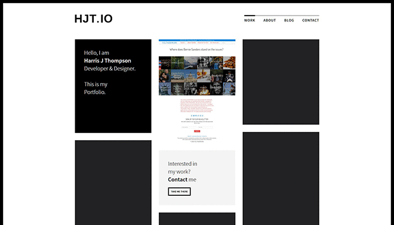
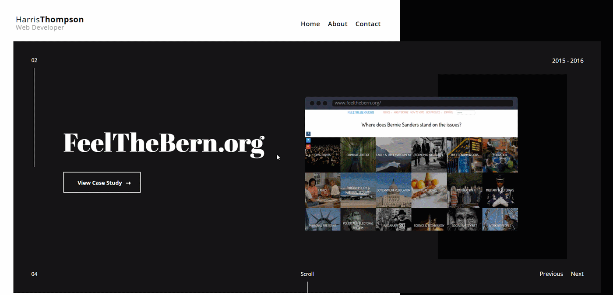
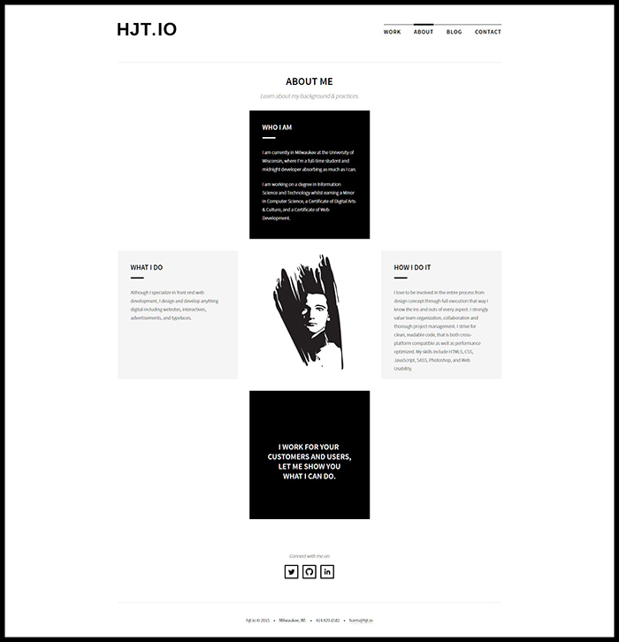

My previous portfolios have been the primary source of my passion for web design and development. They have always been the side projects I have dedicated the most time on during my learning progress. I have seen many portfolios using the same tired layout and techniques so representing myself in a unique way that shows off my ability and uses the most current technologies means a lot to me. In this case study, I will talk about my previous three portfolios.

## Challenge

Present a clean and professional display of my released personal projects. Show off artistic skill in balance with performance and understanding of core languages.

## Approach

### User Experience

I have always believed that the most important aspects of a portfolio are the case studies so I wanted those to be a prominent feature. On all three past portfolios, the case studies are available immediately and are the focus of the homepages. The about page is also important and thus the first link on each menu. I wanted these pages to have a low amount of writing that is succinct and telling. I also felt it was important to have a prominent contact page that offers options to contact me (the link to contact and my email are available on every page as well) as this is the ideal end goal for my audience.

### Typography

Since this is a stylistic portfolio I wanted my fonts to match the designs. In all portfolios, the overarching aspect is professional and sharp so I wanted fonts with sharp edges and prominence. My third portfolio used Abril Fatface for titles because it has a huge contrast to the body font and grabs the attention of the reader whilst fitting in to the bold design. as well as being professional and bold, I want the content to be readable for people who must scan portfolios all day or just to appeal to a wide audience I use my popular choice of Open Sans. Open Sans is a very neutral and legible font that plays off the heading font to sum up the whole portfolio design in type.

### Color

There is a common theme amongst all my previous portfolios, grayscale. Something about the design of sharp edges and simple black and white appeals to me for a professional and bold look. I like to use bright colors as the accent to this to provide some life in the design and keep the eyes from getting too deprived. On my third and first portfolio I use the brand colors when possible for accents on hover and link styles. For my second portfolio, I chose six different bright colors that I found appealing and spread them amongst the projects to add a “fun” element to the design. On my third portfolio, I took aspects from each and use random but consistent bright colors for links and brand colors when possible.

## Results

I was always happy with the code and design of my previous portfolios, in fact I think the last one was more artistic than this one, however each portfolio had negatives too. Each one bugged me enough to make another, and I could never reconcile continuing with the designs, something always wasn't right. In my last portfolio, I knew it worked on my desktop and I wrote an incredible amount of css to make it work with various media queries, against various standards such as standardizing breakpoints or mobile first design. It was vanilla javascript and each page had to be created by copy and pasting html code which I didn't feel made sense in this current ecosystem of static site generators. My current portfolio addresses all my concerns with my previous attempts and now I know why many of the decisions I made designing it are made thanks to my experience with these portfolios. Overall, success in learning, the best kind!

