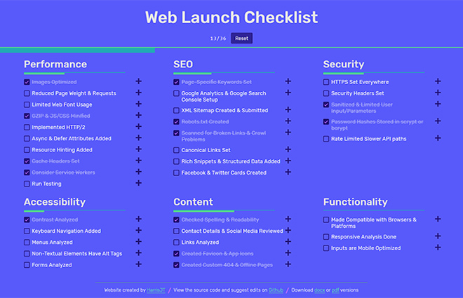
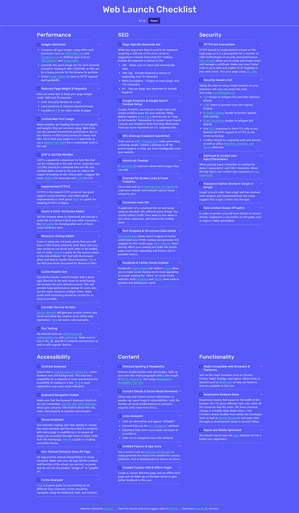

WebLaunchChecklist is a free to use checklist that provides the best tips to enhancing a website before launch. The website is available in offline, pdf, and docx formats so that you can modify it for personal use. I also wanted it to be easy to suggest changes so I open-sourced the code on GitHub and wrote a contribution guide. I created the website because the most passed around web checklists were almost half a decade old and filled with what is now considered wrong information.

## Challenge

Create a website that outlines the most impactful tips for launching an optimized website. Keep explanations beginner freindly and expert insightful. Suggest various tools when appropriate and refrain from any biased sources. Add utility to the website by allowing users to track their progress through the tips. The development must allow for tracking tips offline, post-refresh, and on mobile.

## Approach

### User Experience

I chose a three column layout because I did not want users to have to scroll for so long and get overwhelmed by all the information. Having the ability to go from one section to the other just by moving your eyes contributes to a less exhausting experience for the user which when dealing with varying skill levels is highly important. Important to creating this website was providing multiple formats so that users could tailor the checklist to their company or individual needs. I am committed to updating the site with mine and others suggestions so that people can bookmark it and use it whenever.

### Typography

I chose Rubik as the heading font for my titles because it fit with my overall design style while being readable and neutral. The font for the extra information within each checklist item is a system font stack which chooses your default font no matter the platform. The system font stack makes users feel comfortable with a font they see all the time and makes no network requests. I plan to use the system font stack more often in the future as performance and usability become even more important.

### Color

The colors for this website are really what excited me to complete the project. I wanted desperately to branch out from the monochromatic color schemes of some of my past works and explore how different colors work together. The animations also have a “jelly” characteristic that works with the colors to give off a unique feel that I believe works with this sort of single-page website.

## Results

I am happy with how the website came out overall. I got important feedback that the design did not exactly fit the utility of the website and a more general "black text on white background" would have been better. I learned about garnering open source contribution and in future I will strive to write contribution guidelines that motivate contributors.

